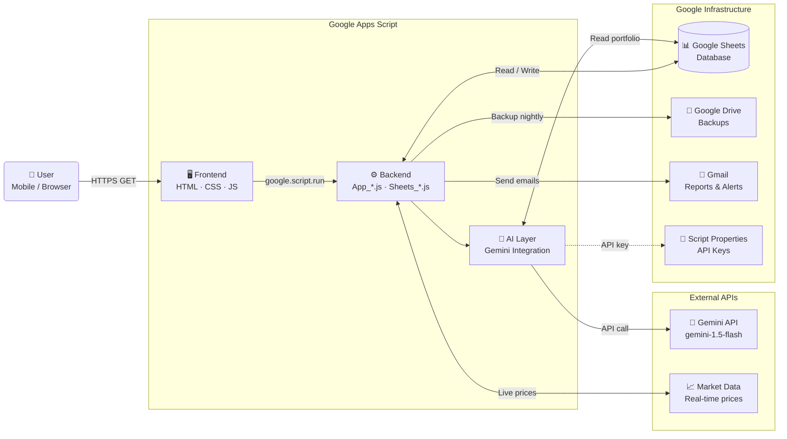
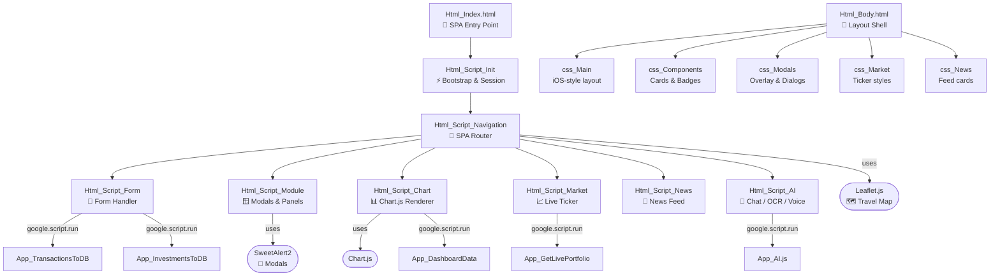
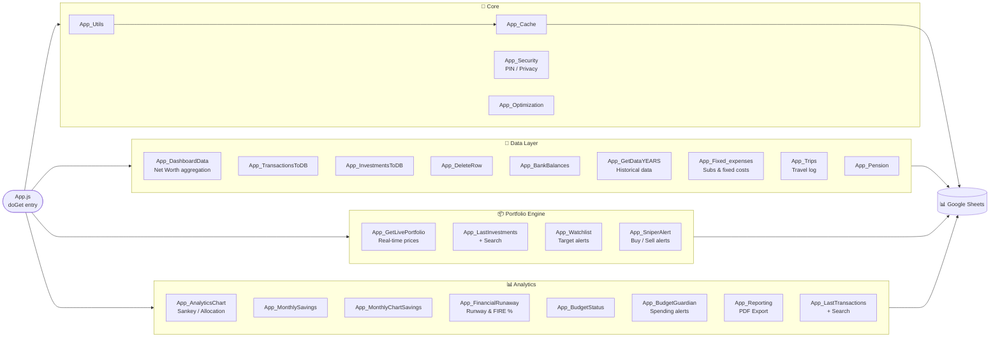
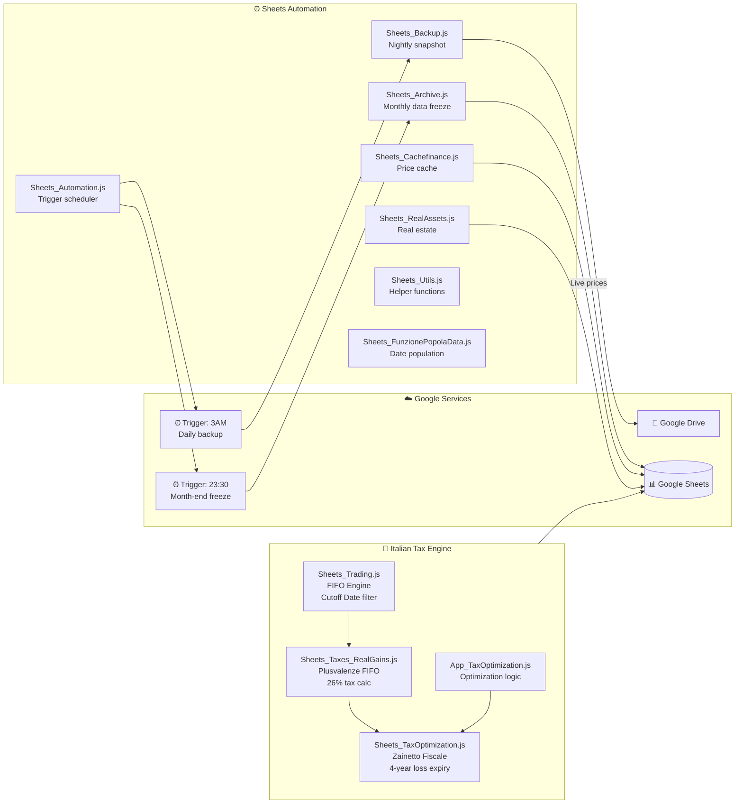
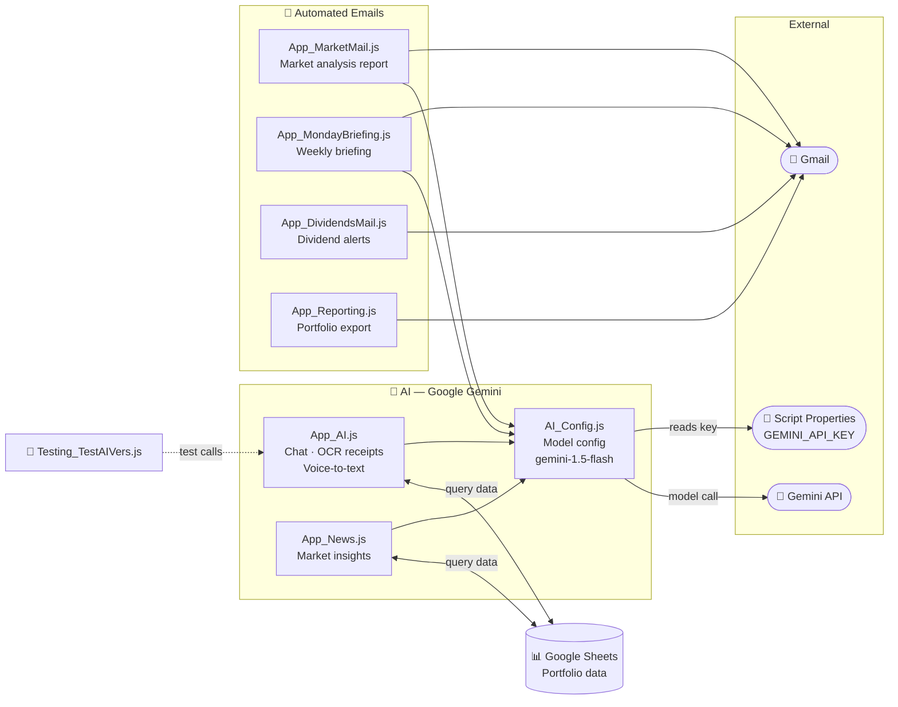

# 🏗️ Wealth-App — Architecture

> The app is a **Google Apps Script SPA** built on top of Google Sheets.  
> Below are 5 focused diagrams covering each architectural layer.

---

## 1️⃣ System Overview

---

## 2️⃣ Frontend Architecture

---

## 3️⃣ Backend Modules

---

## 4️⃣ Tax Engine & Sheets Automation

---

## 5️⃣ AI & Notifications Layer

