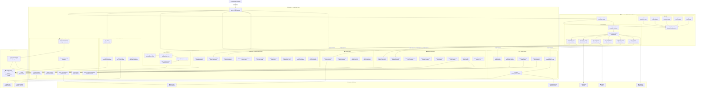

# 🏗️ Wealth-App — Architecture Diagram

> Full architecture of the Google Apps Script SPA, auto-rendered by GitHub.

```mermaid
graph TD
    %% ─────────────────────────────────────────
    %% ENTRY POINT
    %% ─────────────────────────────────────────
    USER["👤 Utente (Mobile / Browser)"]

    subgraph FRONTEND["🖥️ Frontend — HTML / CSS / Vanilla JS"]
        direction TB
        HI["Html_Index.html\n(SPA Shell / Router)"]
        HB["Html_Body.html\n(Layout & Componenti UI)"]

        subgraph JS_MODULES["Script Modules"]
            direction LR
            JS_INIT["Html_Script_Init\n(Bootstrap / Sessione)"]
            JS_NAV["Html_Script_Navigation\n(Routing SPA)"]
            JS_FORM["Html_Script_Form\n(Form Handler)"]
            JS_MOD["Html_Script_Module\n(Modali & Pannelli)"]
            JS_CHART["Html_Script_Chart\n(Chart.js Render)"]
            JS_MARKET["Html_Script_Market\n(Live Ticker)"]
            JS_NEWS["Html_Script_News\n(Feed Notizie)"]
            JS_AI["Html_Script_AI\n(Chat AI / OCR / Voice)"]
        end

        subgraph CSS_LAYERS["Stili CSS"]
            direction LR
            CSS_MAIN["css_Main\n(Layout iOS-style)"]
            CSS_COMP["css_Components\n(Card / Badge)"]
            CSS_MOD2["css_Modals\n(Overlay / Dialog)"]
            CSS_MKT["css_Market\n(Ticker / Grafici)"]
            CSS_NEWS2["css_News\n(Feed Cards)"]
        end
    end

    subgraph BACKEND["⚙️ Backend — Google Apps Script"]
        direction TB

        APP_MAIN["App.js\n(doGet — Web App Entry)"]

        subgraph CORE["Core & Infrastruttura"]
            APP_UTILS["App_Utils.js\n(Helper comuni)"]
            APP_CACHE["App_Cache.js\n(CacheService wrapper)"]
            APP_SEC["App_Security.js\n(PIN / Privacy Mode)"]
            APP_OPT["App_Optimization.js\n(Batch & Performance)"]
        end

        subgraph DATA_LAYER["Data Layer — Lettura/Scrittura Sheets"]
            APP_DASH["App_DashboardData.js\n(Aggregazione NW)"]
            APP_TRANS_DB["App_TransactionsToDB.js\n(Salva Transazioni)"]
            APP_INV_DB["App_InvestmentsToDB.js\n(Salva Investimenti)"]
            APP_DEL["App_DeleteRowToSpreadsheets.js\n(Elimina righe)"]
            APP_YEARS["App_GetDataYEARS.js\n(Dati storici annui)"]
            APP_BANK["App_BankBalances.js\n(Saldi Conti)"]
            APP_FIXED["App_Fixed_expenses.js\n(Spese fisse e Sub.)"]
            APP_TRIPS["App_Trips.js\n(Travel Log / Mappa)"]
            APP_PENSION["App_Pension.js\n(Calcolo Pensione)"]
        end

        subgraph PORTFOLIO_ENGINE["📦 Portfolio Engine"]
            APP_LIVE["App_GetLivePortfolio.js\n(Prezzi real-time)"]
            APP_LASTINV["App_LastInvestments.js\n(Ultime operazioni)"]
            APP_WATCH["App_Watchlist.js\n(Target Price Alert)"]
            APP_SNIPER["App_SniperAlert.js\n(Alert Acquisto/Sell)"]
        end

        subgraph ANALYTICS["📊 Analytics & Reporting"]
            APP_CHART2["App_AnalyticsChart.js\n(Sankey / Allocation)"]
            APP_SAVINGS["App_MonthlySavings.js\n(Risparmio mensile)"]
            APP_CHART_SAV["App_MonthlyChartSavings.js\n(Chart Risparmi)"]
            APP_RUNWAY["App_FinancialRunaway.js\n(Runway / FIRE%)"]
            APP_BUDGET["App_BudgetStatus.js\n(Stato Budget)"]
            APP_GUARD["App_BudgetGuardian.js\n(Soglie Avviso)"]
            APP_REPORT["App_Reporting.js\n(Export Report)"]
            APP_LASTTX["App_LastTransactions.js\n(Ricerca TX)"]
        end

        subgraph TAX_MODULE["🧾 Fiscalita italiana"]
            APP_TAX["App_TaxOptimization.js\n(Zainetto Fiscale)"]
            SHEETS_TAX["Sheets_TaxOptimization.js"]
            SHEETS_TAXES["Sheets_Taxes_RealGains.js\n(Plusvalenze FIFO)"]
            SHEETS_TRADING["Sheets_Trading.js\n(FIFO Engine / Cutoff)"]
        end

        subgraph AI_MODULE["🤖 AI — Google Gemini"]
            AI_CFG["AI_Config.js\n(Model: gemini-1.5-flash)"]
            APP_AI_BE["App_AI.js\n(Prompt Builder / Chat)"]
            APP_NEWS_BE["App_News.js\n(Market Insight)"]
            APP_MARKET["App_MarketMail.js\n(Mail Analisi Mercato)"]
            APP_MONDAY["App_MondayBriefing.js\n(Email Lunedi)"]
            APP_DIV["App_DividendsMail.js\n(Alert Dividendi)"]
        end

        subgraph SHEETS_LAYER["📋 Google Sheets Automation"]
            SHEETS_AUTO["Sheets_Automation.js\n(Trigger Scheduler)"]
            SHEETS_BACKUP["Sheets_Backup.js\n(Nightly Backup Drive)"]
            SHEETS_ARCHIVE["Sheets_Archive.js\n(Freeze Dati Mensili)"]
            SHEETS_CACHE_FIN["Sheets_Cachefinance.js\n(Cache Prezzi)"]
            SHEETS_REAL["Sheets_RealAssets.js\n(Immobili)"]
            SHEETS_UTILS["Sheets_Utils.js\n(Helper Sheets)"]
            SHEETS_DATA["Sheets_FunzionePopolaData.js\n(Popolamento date)"]
        end
    end

    subgraph GOOGLE_INFRA["☁️ Google Infrastructure"]
        GS["📊 Google Sheets\n(Expenses Tracker · NW Analitico\nPortfolio · Watchlist · Config)"]
        GDRIVE["💾 Google Drive\n(Backup notturni)"]
        GMAIL_SVC["📧 Gmail\n(Report email)"]
        PROPS["🔑 Script Properties\n(GEMINI_API_KEY)"]
        TRIGGER["⏰ Time-Driven Triggers\n(3AM Backup · 23:30 Freeze)"]
    end

    subgraph EXTERNAL_API["🌐 Librerie e API Esterne"]
        GEMINI["🤖 Google Gemini API\n(gemini-1.5-flash)"]
        MARKET_API["📈 Market Data\n(prezzi real-time)"]
        LEAFLET["🗺️ Leaflet.js\n(Mappe Viaggi)"]
        CHARTJS["📉 Chart.js\n(Grafici)"]
        SWA["🔔 SweetAlert2\n(Modali)"]
    end

    %% ─────────────────────────────────────────
    %% CONNECTIONS
    %% ─────────────────────────────────────────

    USER -->|"HTTPS GET"| APP_MAIN
    APP_MAIN --> HI
    HI --> HB
    HI --> JS_INIT
    JS_INIT --> JS_NAV
    JS_NAV --> JS_FORM
    JS_NAV --> JS_MOD
    JS_NAV --> JS_CHART
    JS_NAV --> JS_MARKET
    JS_NAV --> JS_NEWS
    JS_NAV --> JS_AI

    JS_FORM -->|"google.script.run"| APP_TRANS_DB
    JS_FORM -->|"google.script.run"| APP_INV_DB
    JS_CHART -->|"google.script.run"| APP_CHART2
    JS_CHART -->|"google.script.run"| APP_SAVINGS
    JS_MARKET -->|"google.script.run"| APP_LIVE
    JS_NEWS -->|"google.script.run"| APP_NEWS_BE
    JS_AI -->|"google.script.run"| APP_AI_BE

    APP_MAIN --> CORE
    APP_MAIN --> DATA_LAYER
    APP_MAIN --> PORTFOLIO_ENGINE
    APP_MAIN --> ANALYTICS
    APP_MAIN --> TAX_MODULE
    APP_MAIN --> AI_MODULE

    APP_UTILS --> APP_CACHE
    APP_CACHE --> GS
    APP_SEC --> PROPS

    DATA_LAYER --> GS
    PORTFOLIO_ENGINE --> GS
    ANALYTICS --> GS
    TAX_MODULE --> GS

    APP_AI_BE --> AI_CFG
    AI_CFG --> PROPS
    AI_CFG --> GEMINI

    APP_LIVE --> MARKET_API
    SHEETS_CACHE_FIN --> MARKET_API

    SHEETS_AUTO --> TRIGGER
    TRIGGER --> SHEETS_BACKUP
    TRIGGER --> SHEETS_ARCHIVE
    SHEETS_BACKUP --> GDRIVE

    APP_MARKET --> GMAIL_SVC
    APP_MONDAY --> GMAIL_SVC
    APP_DIV --> GMAIL_SVC
    APP_REPORT --> GMAIL_SVC

    SHEETS_TRADING --> SHEETS_TAXES
    SHEETS_TAXES --> SHEETS_TAX
    APP_TAX --> SHEETS_TAX

    JS_CHART --> CHARTJS
    JS_NAV --> LEAFLET
    JS_MOD --> SWA

    CSS_MAIN --> HB
    CSS_COMP --> HB
    CSS_MOD2 --> HB
    CSS_MKT --> HB
    CSS_NEWS2 --> HB

    SHEETS_REAL --> GS
    APP_REPORT --> GS
```